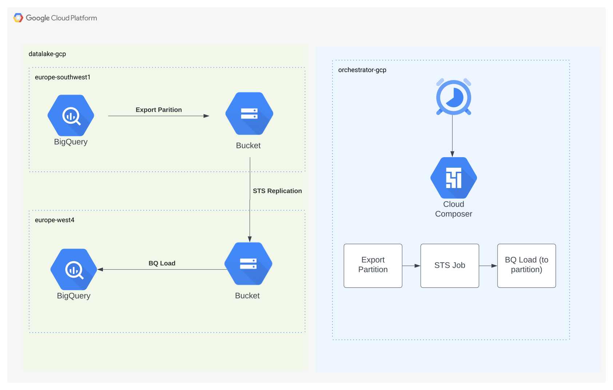
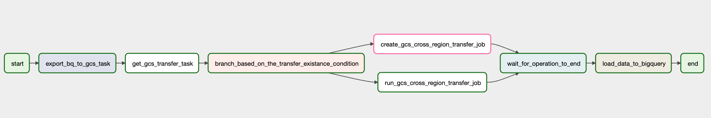

# gcp-bq-dataset-cross-region-replicator
This repo contains an example of the e2e Airflow workload to automate BigQuery cross region replication (compliant with CMEK and using specific partitions)

## Reasonale
In GCP BigQuery datasets are regional. There is a good level of redundancy and HA guarantees within a region (using different zones), but currently (Q1 2023) there is no automatic cross-region replication provided by the product to meet the cross-regional DR requirements.

In many cases using BigQuery Data Transfer Service can be enough to replicate data between different regions. But for datasets with additional CMEK requirements (see link below), this is not an option. Also, if you want to export / replicate only a specific partition (daily delta), you are free to do so - to minimize the amount of data being transfer in each run.

## High Level Architecture
The e2e process is using a standard Airflow DAG deployed in Cloud Composer. It creates (or reuses) the STS transfer to move files between different buckets. To export / load data from / to BigQuery, a standard BigQuery operators (using API EXTRACT and LOAD operations). The flow can be run on-demand or with a Airflow defined schedule. The STS jobs are set to be run on demand - controlled by Composer schedule.

## DAG Logic

The DAG logic is mostly self-explanatory. Some operations (runTransfer) in the TransferService hook are not currently enabled, hence the need to extend the hook and the operator. Addionally, to wait for the in-progress transfer, a new Sensor has been created (the existing one will return success if any of the transfers has finished).

## See Also
- BigQuery Data Transfer Service - [documentation](https://cloud.google.com/bigquery/docs/dts-introduction)
- CMEK Limitation in BigQuery Data Transfer [documentation](https://cloud.google.com/bigquery/docs/copying-datasets#destination_dataset_limitations)
- Cloud Storage Transfer Service - Transfer between Cloud Storage buckets [documentation](https://cloud.google.com/storage-transfer/docs/cloud-storage-to-cloud-storage)